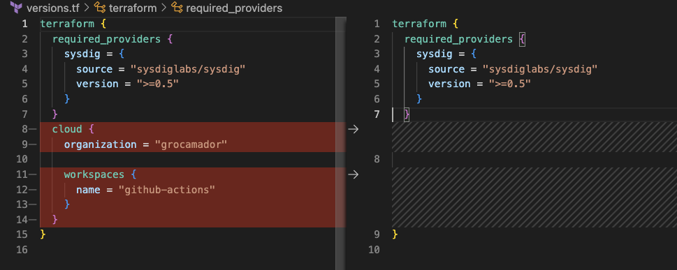

# Sysdig Runtime Policies as a code
Manage Sysdig runtime policies on a GitOps fashion

## Table of contents
* [Overview](#overview)
* [Purpose](#Purpose)
* [Requirements](#requirements)
* [Setup](#setup)


## Overview
This is an example of how to manage Sysdig runtime policies with a GitOps approach by using GitHub to version and manage the security policies and rules, Terraform to define the rules and polices as a code and GitHub Actions to automatically apply new commited changes into the Sysdig Secure platform.


## Purpose
The example configuration supports defining custom [Falco](https://falco.org) rules and runtime custom policies for any Workload, Kubernetes and AWS cloud trail by using the Sysdig Terraform provider. It also allows to create and mantain mail notifications and then configure it when an alert is triggered.

## Requirements
BLABA

## Setup
It can be use in 2 different ways:

* As a [Standalone](#standalone-installation) way to deploy Sysdig runtime policies and rules leveraging Terraform provider
* Using Terraform with GitHub Actions to manage and mantain Sysdig runtime policies with [GitOps approach](#Gitops-approach)

### Standalone Installation
Clone the repository, you can then delete  or ignore the `.github/workflows` folder.
From the `versions.tf` delete the section that refers to my Terraform cloud organization



Modify the following variable values either by changing `variables.tf` values, creating a new `.tfvars` file or use an environment variable `export TF_VAR_sysdig_variable`

```
sysdig_api_token= ""
sysdig_saas_region= ""
#Optional
mail_users= ["mail1","mail2"]

```
- For `sysdig_api_token` [fetch the Sysdig Api Token](https://docs.sysdig.com/en/docs/administration/administration-settings/user-profile-and-password/retrieve-the-sysdig-api-token) from the Sysdig Secure platform.


- For `sysdig_saas_region` please check the SaaS endpoint in the [SaaS Regions and IP Ranges](https://docs.sysdig.com/en/docs/administration/saas-regions-and-ip-ranges/) documentation

Make sure you have installed Terraform on your local machine and initialize it:

$terraform init

Create an execution plan

$terraform plan


### GitOps installation with GitHub Actions and Terraform Cloud
blablabla WIP


