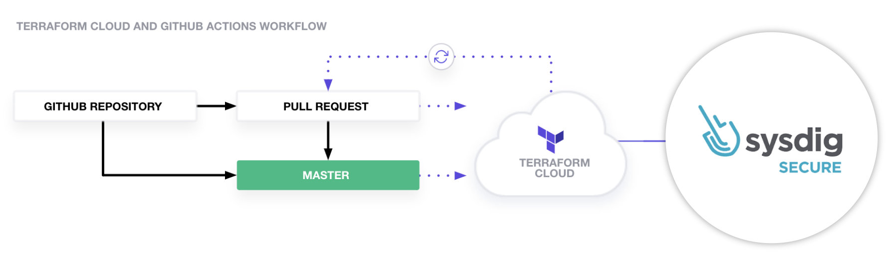
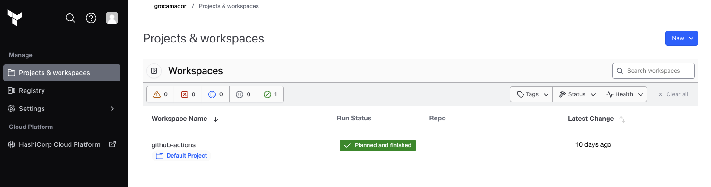
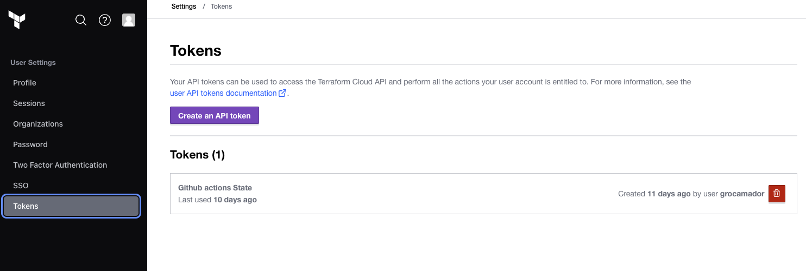
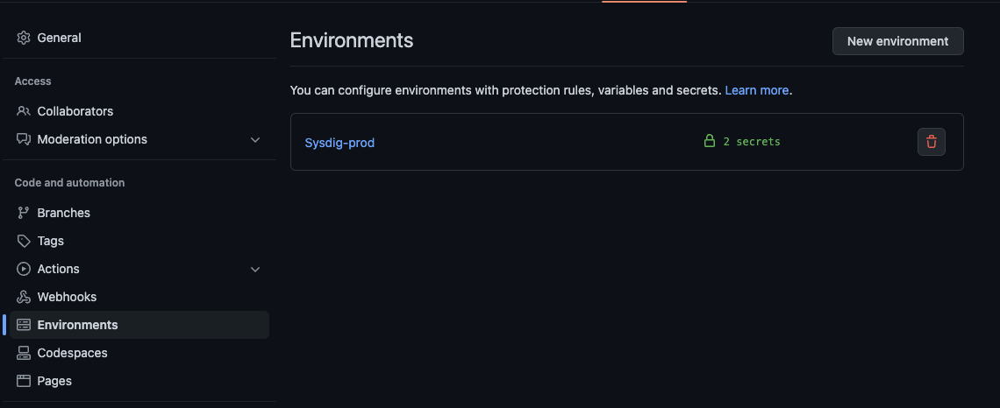
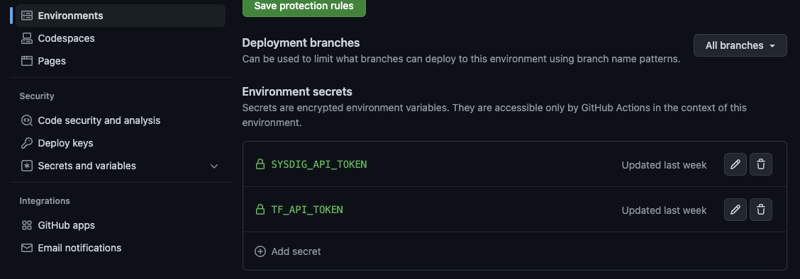

# Sysdig Runtime Policies as a code
Manage Sysdig runtime policies as a code.

## Table of contents
* [Overview](#overview)
* [Purpose](#Purpose)
* [Requirements](#requirements)
* [Setup](#setup)


## Overview
This is an example of how to manage Sysdig runtime policies as a code with GitHub actions and Terraform cloud:
- GitHub to version and manage the Sysdig runtime security policies and rules
- Terraform configuration language to define the Sysdig runtime rules and polices as a code 
- GitHub Actions and Terraform to automatically apply new commited changes into the Sysdig Secure platform.

This repository contains Sysdig runtime rules and runtime policies definitions on Terraform as well as the GitHub actions workflow needed to apply any new change automatically into Sysdig, here it is an overview of the workflow:



## Purpose
The example configuration supports defining custom [Falco](https://falco.org) rules and runtime custom policies for any Workload, Kubernetes and AWS cloud trail by using the Sysdig Terraform provider. It also allows to create and mantain mail notifications and then configure it when an alert is triggered.

## Requirements
- A Sysdig Secure platform with a runtime administrator API token 
- A GitHub dedicated repository (Optional for working with GigHub actions)
- A [Terraform Cloud](https://app.terraform.io/) account, you can create one for free (Optonal for working on with GitHub actions)

## Setup
It can be use in 2 different ways:

* As a [Standalone](#standalone-installation) way to deploy Sysdig runtime policies and rules leveraging Terraform provider
* Using Terraform with GitHub Actions to manage and mantain Sysdig runtime policies with [with GitHub Actions](#installation-with-GitHub-Actions-and-Terraform-Cloud)

### Standalone Installation
Clone the repository, you can then delete  or ignore the `.github/workflows` folder.
From the `versions.tf` delete the section that refers to my Terraform cloud organization:


Modify the following variable values either by changing `variables.tf` values, creating a new `.tfvars` file or use an environment variable `export TF_VAR_sysdig_variable`

```
sysdig_api_token= ""
sysdig_saas_region= ""
#Optional
mail_users= ["mail1","mail2"]

```
- For `sysdig_api_token` [fetch the Sysdig Api Token](https://docs.sysdig.com/en/docs/administration/administration-settings/user-profile-and-password/retrieve-the-sysdig-api-token) from the Sysdig Secure platform.


- For `sysdig_saas_region` please check the SaaS endpoint in the [SaaS Regions and IP Ranges](https://docs.sysdig.com/en/docs/administration/saas-regions-and-ip-ranges/) documentation

Make sure you have installed Terraform on your local machine and initialize it:

```
$terraform init
```

Create an execution plan

```
$terraform plan
```
Apply the proposed actions


```
$terraform apply
```

### Installation with GitHub Actions and Terraform Cloud
Fork or clone this Git repository, you will then need a Terraform cloud workspace to store the Terraform state. 

#### Terraform cloud configuration
Log in or create your free account on [Terraform Cloud](https://app.terraform.io/)

Choose or create a new workspace:



Create a dedicated Terraform API token for this project and copy the value:



Update the `versions.tf` with the Terraform cloud organization and the workspace just created.

```
terraform {
  required_providers {
    sysdig = {
      source = "sysdiglabs/sysdig"
      version = ">=0.5"
    }
  }
   cloud {
    organization = "<your-tf-organization>"

    workspaces {
      name = "<your-tf-worspace>"
    }
  }
}
```
#### GitHub configuration
Modify the following variable values either by changing `variables.tf` values, creating a new `.tfvars` file or using an environment variable on GitHub actions:

```
sysdig_saas_region= ""
#Optional
mail_users= ["mail1","mail2"]
````

Create a new GitHub environment (in this case is `Sysdig-prod`):




Update the GitHub actions definition at `.github/workflows/terraform.yml` with the name of the GitHub environment configured in the previous steps:

```
name: 'Sysdig Runtime as a Code with Terraform and GitHub actions'

on:
  push:
    branches: [ "main" ]
  pull_request:
   branches:
   - main

env:
 # verbosity setting for Terraform logs
 TF_LOG: INFO
 # Credentials for deployment to Sysdig Secure
 TF_VAR_sysdig_api_token : ${{ secrets.SYSDIG_API_TOKEN }}

   
permissions:
  contents: read

jobs:
  terraform:
    name: 'Terraform IAC'
    runs-on: ubuntu-latest
    environment: <environment-name>
...
```
Create two secrets under the environment just created:



- For `SYSDIG_API_TOKEN` [fetch the Sysdig Api Token](https://docs.sysdig.com/en/docs/administration/administration-settings/user-profile-and-password/retrieve-the-sysdig-api-token) from the Sysdig Secure platform.
- For the `TF_API_TOKEN` secret use the value of the token created under [Terraform cloud configuration](#terraform-cloud-configuration)

Make some change in any TF file, push the changes to the main branch and let GitHub actions and Terraform build the security policy and rules for you.
